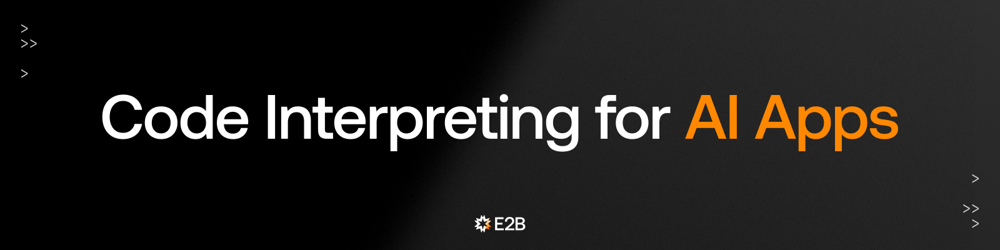

## About E2B

We make it easy for developers to add code interpreting to AI apps with our Code Interpreter SDK.

<h3>Repositories</h3>

- [E2B](https://github.com/e2b-dev/E2B): The core SDK & CLI
- [Code Interpreter](https://github.com/e2b-dev/code-interpreter): SDK for adding code interpreting to AI apps (built on top of E2B)
- [Infra](https://github.com/e2b-dev/infra): Infrastructure powering E2B

<h3>Docs</h3>

Official documentation is at [e2b.dev/docs](https://e2b.dev/docs).

<!---
The Code Interpreter SDK is built on top of our open-source [runtime for AI agents](https://github.com/e2b-dev/e2b). Get started with [our docs](https://e2b.dev/docs).
The SDK features make it a natural building block for AI engineers.
--->

<!---
- Works with any LLM and AI framework
- Supports streaming content like charts and stdout, stderr
- Python & JS SDK
- 100% open source.

E2B works with any LLM and you can use it with popular AI frameworks like LangChain, AutoGen, or CrewAI. For inspiration, see our [Cookbook](https://github.com/e2b-dev/e2b-cookbook).
--->

<!---
<h3>E2B works with any LLM...</h3>

- [Anthropic Claude 3 Opus with a code interpreter](https://github.com/e2b-dev/e2b-cookbook/blob/main/examples/claude-code-interpreter/claude_code_interpreter.ipynb)
- [🦙 Llama 3 with code interpreter](https://github.com/e2b-dev/e2b-cookbook/tree/main/examples/llama-3-code-interpreter)
- [Mixtral with code interpreter and chat UI](https://github.com/e2b-dev/e2b-cookbook/tree/main/templates/mixtral-8x7b-code-interpreter-nextjs)

<h3>... And with popular AI frameworks</h3>

- [🦜⛓️ LangChain with code interpreter](https://github.com/e2b-dev/e2b-cookbook/tree/main/examples/langchain-python)
- [🦜🕸️ LangGraph with code interpreter](https://github.com/e2b-dev/e2b-cookbook/tree/main/examples/langgraph-python)
- [Autogen with secure sandboxed code interpreter](https://github.com/e2b-dev/e2b-cookbook/tree/main/examples/e2b_autogen)

--->

<!---
<h3>Guides</h3>

- [Build custom Code Interpreter with E2B and GPT-4](https://e2b.dev/docs/guide/simple-gpt4-code-interpreter)
- [Use E2B Sandbox with OpenAI Assistants API](https://e2b.dev/docs/llm-platforms/openai#python)
- [Create a custom sandbox](https://e2b.dev/docs/guide/custom-sandbox)

--->

<!---
<h3>Use cases & community examples</h3>

- [OpenDevin - an open-source AI software engineer using E2B sandboxes](https://github.com/OpenDevin/OpenDevin)
- [OpenAI integration for Discord](https://github.com/Kav-K/GPTDiscord) 
- [Custom Code Interpreter with AgentLabs and E2B](https://docs.agentlabs.dev/recipes/code-interpreter)
--->

<!---
<h3>Premade sandboxes to try</h3>

- [Default Sandbox](https://e2b.dev/docs/sandbox/templates/premade#1-default-sandbox)
- [Code Interpreter Sandbox](https://e2b.dev/docs/sandbox/templates/premade#2-code-interpreter-data-analysis-sandbox)
- (Soon) Cloud Browser Sandbox
  
Or build your [**Custom Sandbox**](https://e2b.dev/docs/sandbox/templates/overview).
--->

<!--
<h3>E2B supports</h3>

-->

<h2>Where to find us</h2>

Need help setting up E2B? We are happy to connect! Give us any feedback on your experience with E2B. 

<!--   -->
 
 
 

<h2>We are hiring!</h2>

Check out the [open positions](https://e2bdev.notion.site/Careers-at-E2B-2163f176991f43f69b0984bf2a142920) at E2B. We are hiring in-person only in San Francisco.

</li>

 

