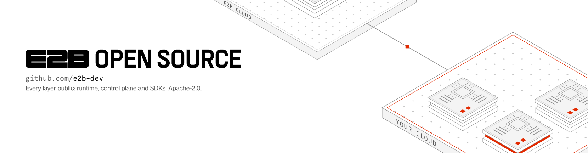

<picture>
  <source media="(prefers-color-scheme: dark)" srcset="./readme-assets/e2b-open-source-dark.png">
  
</picture>

# e2b-dev/.github

Organization-wide defaults for [E2B](https://e2b.dev) on GitHub.

- [`profile/README.md`](./profile/README.md) is the organization profile shown at [github.com/e2b-dev](https://github.com/e2b-dev). Edit it there.
- [`.github/ISSUE_TEMPLATE/`](./.github/ISSUE_TEMPLATE/) holds the issue forms every E2B repository inherits unless it ships its own.
- [`readme-assets/`](./readme-assets/) holds the banner images. Light and dark variants share identical geometry, and GitHub picks one by theme through the `<picture>` block above.

For E2B itself, start at the [organization profile](https://github.com/e2b-dev) or the [docs](https://docs.e2b.dev).
