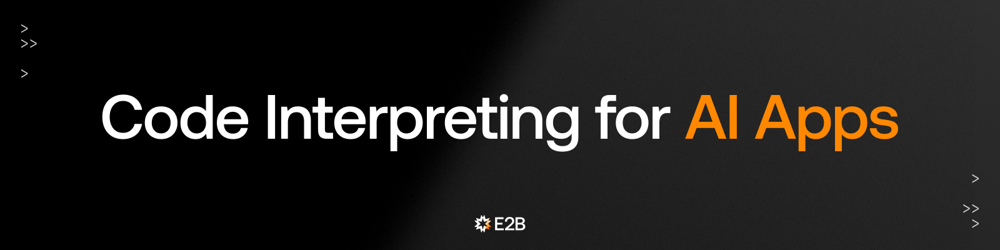

## About E2B

We make it easy for developers to add code interpreting to AI apps with the E2B SDK. Read our documentation at [e2b.dev/docs](https://e2b.dev/docs).

<h3>Getting started</h3>

- Start with the [Quickstart guide in our documentation](https://e2b.dev/docs/quickstart).

<h3>Repositories</h3>

- [E2B SDK](https://github.com/e2b-dev/E2B): The SDK & CLI for creating and controlling E2B sandboxes and adding code interpreting to AI apps.
- [E2B Code Interpreter](https://github.com/e2b-dev/code-interpreter): Python & JS/TS SDK for running AI-generated code in your AI app with E2B Sandbox.
- [E2B Desktop](https://github.com/e2b-dev/desktop): E2B Sandbox with desktop graphical environment that you can connect to any LLM for secure computer use.
- [Infra](https://github.com/e2b-dev/infra): Infrastructure powering E2B.

<h3>Examples</h3>

- [Fragments](https://github.com/e2b-dev/fragments): Open-source template for building apps like Anthropic's Claude Artifacts, Vercel v0, or GPT Engineer.
- [Surf](https://github.com/e2b-dev/surf): Surf is a computer use AI agent powered by OpenAI that interacts with a E2B's virtual desktop environment through natural language instructions.
- [Secure Computure Use](https://github.com/e2b-dev/secure-computer-use): A secure cloud Linux computer powered by E2B Desktop Sandbox and controlled by Anthropic's Claude.
- [E2B Cookbook](https://github.com/e2b-dev/e2b-cookbook): Example code and guides for building with E2B SDK.
 
<h3>Where to find us</h3>

Need help setting up E2B? We are happy to connect! Give us any feedback on your experience with E2B. 

<!--   -->
 
 
 

<h3>We are hiring!</h3>

Check out the [open positions](https://e2b.dev/careers) at E2B. We are hiring in-person only in San Francisco.

</li>

 

